# JT Wazuh Agent Manager

[English](README.md) | [繁體中文](README_zh-TW.md)

A powerful web-based management tool for Wazuh agents in cluster environments.

> **Purpose**: This tool is designed to supplement the Wazuh Dashboard by providing missing or inconvenient management features. It is **NOT** intended to replace the Wazuh Dashboard, but to complement it.

> **Recommended**: Use the Web UI as the primary interface - it's the main feature of this tool with full functionality.


## Features

### Agent Management
- View all agents with real-time status
- Advanced filtering (status, group, node, OS, version, IP, name, sync)
- **Convenient multi-select** for batch operations
- **Distribution bar**: Visual statistics bar showing agent distribution by status, OS, version, group, node, or sync status
  - Click on segments to filter agents
  - Animated transitions when switching views
- **Auto-refresh stats**: Top statistics refresh every 10 seconds with slide animation
- **Group operations**:
  - Add to group / Remove from group
  - Merge into another group
  - Keep in specific group only (remove from all other groups)
  - Rename group
  - **Import from CSV** with preview before import
  - **Export to CSV**: Export group members
- Batch operations: restart, reconnect, delete, upgrade
- **Move to Node** (planned): Migrate agents to specific node via HAProxy integration (under development)
- Health check and duplicate detection
- **Queue DB size check**: Monitor agent queue database usage
- Agent upgrade with progress tracking

### Cluster Support
- Full master/worker cluster support
- Node service status monitoring
- **Edit ossec.conf**: Edit configuration files for master and worker nodes
- **Restart services**: Restart Wazuh services on any node
- **Download cluster.key**: Download cluster key from master node
- **WPK file management**: Upload and delete WPK upgrade files
- **Sync status checking**: Monitor file synchronization between master and workers
  - Rules, Decoders, Groups, Keys, Lists, SCA
  - View files that differ between nodes
- SSH remote management for worker nodes

### Statistics & Reports
- Statistics by status, group, node, OS, version, network segment
- Sortable columns in all statistics tables
- Export to JSON/CSV

### Rules Viewer
- **Rule hierarchy visualization**: View rule parent-child relationships as collapsible tree
- Search by Rule ID
- Display rule level, description, and source file
- Click to expand and view full rule XML content
- Support for both built-in and custom rules

### Security
- Input validation for all parameters
- Command injection protection
- Path traversal prevention
- Secure file upload handling
- **Complete logging & audit**: View all operation logs and audit events
- **API user management**: Create, modify, and manage Wazuh API users and roles

## Screenshots

### Login


### Agent List
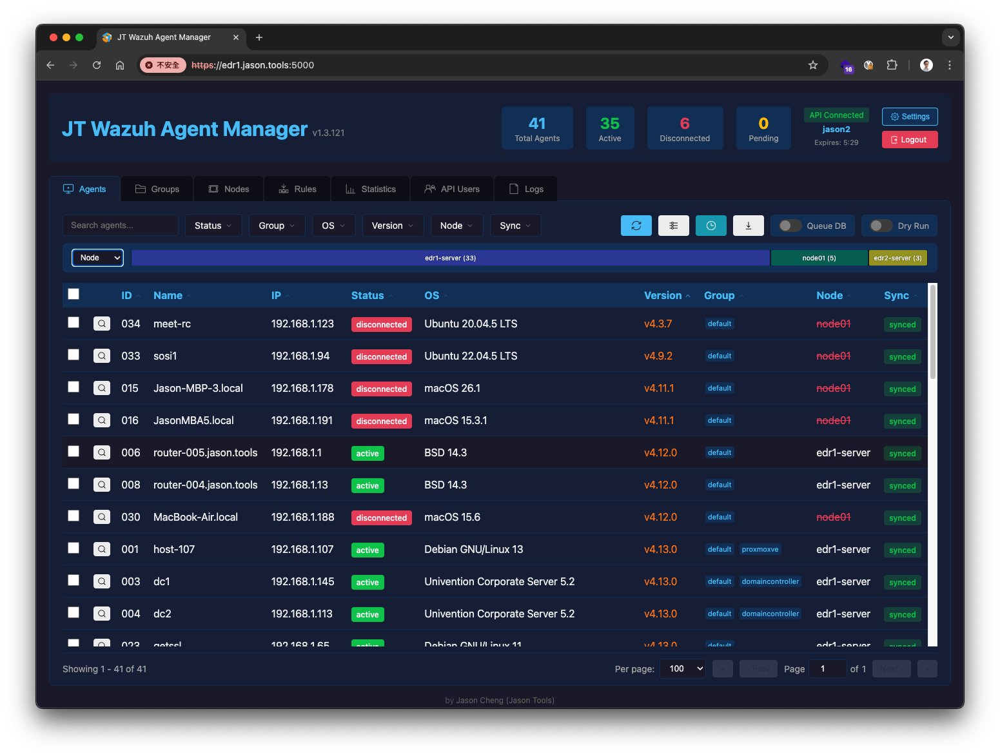

### Agent Actions & Queue DB
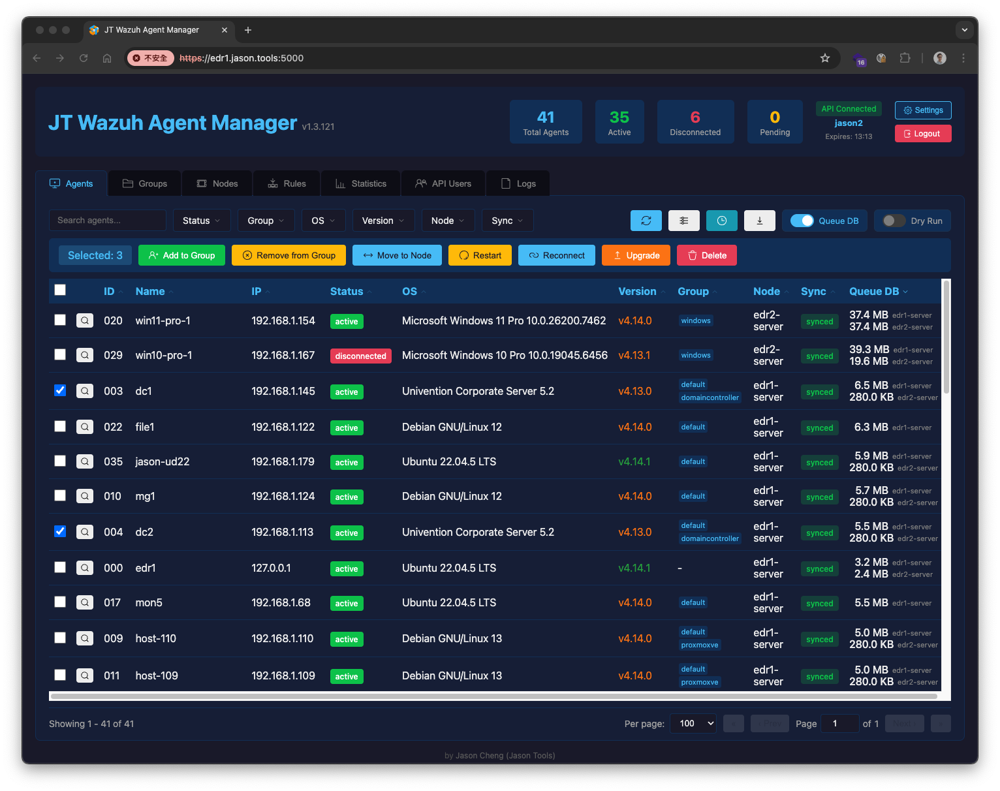

### Groups
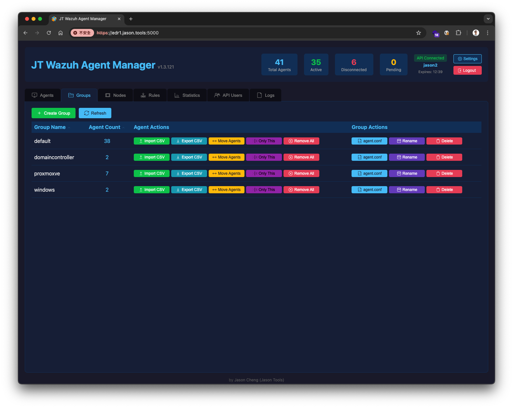

### Nodes
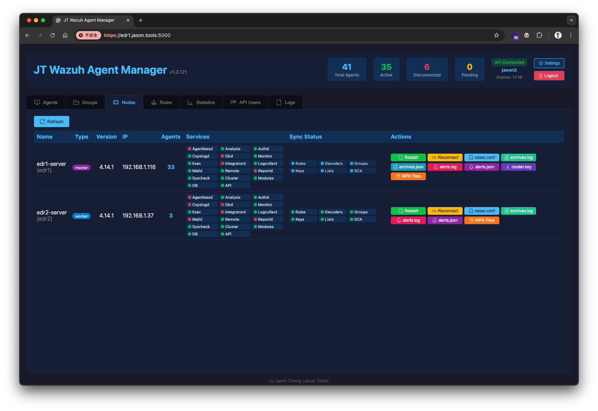

### WPK Files Management
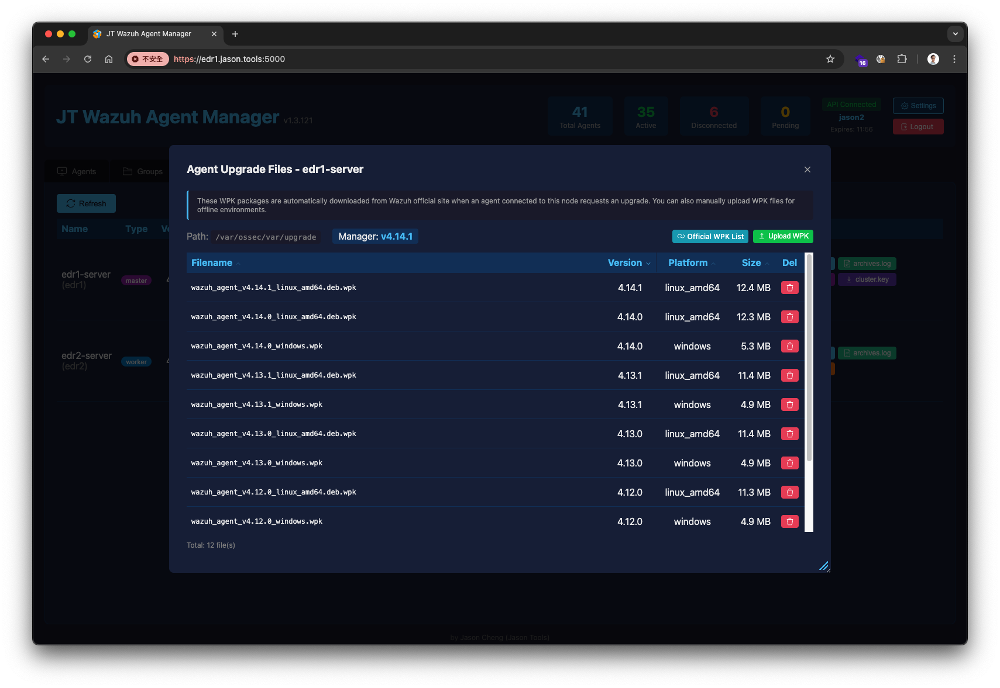

### Rules Viewer
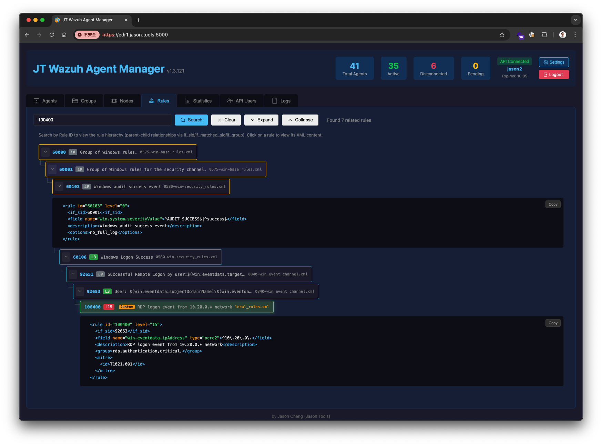

### API Users
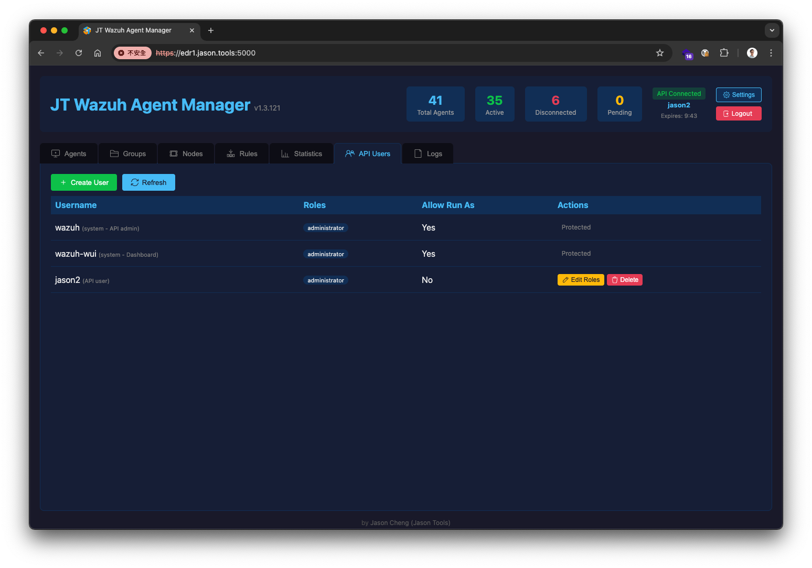

### Logs Viewer
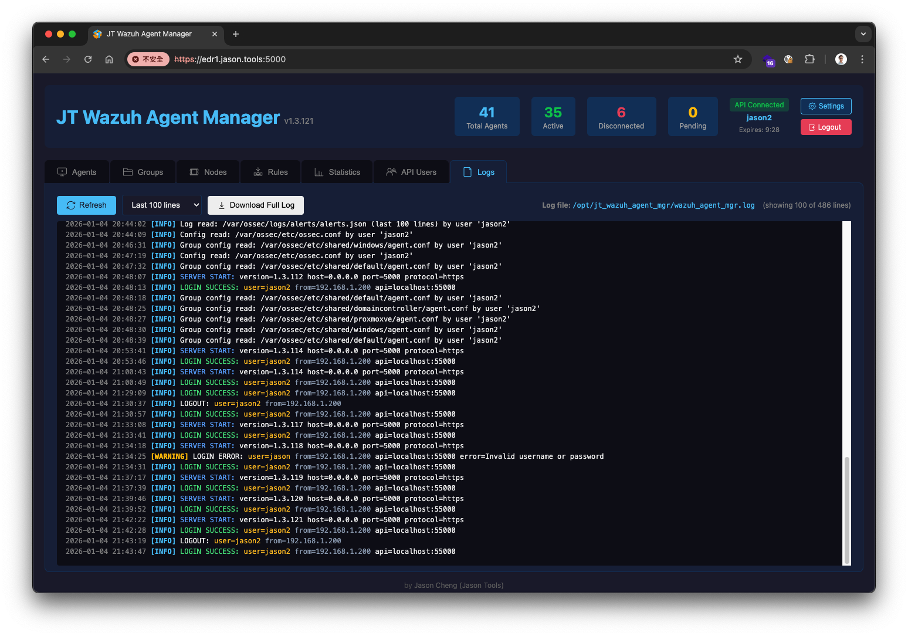

### Edit ossec.conf
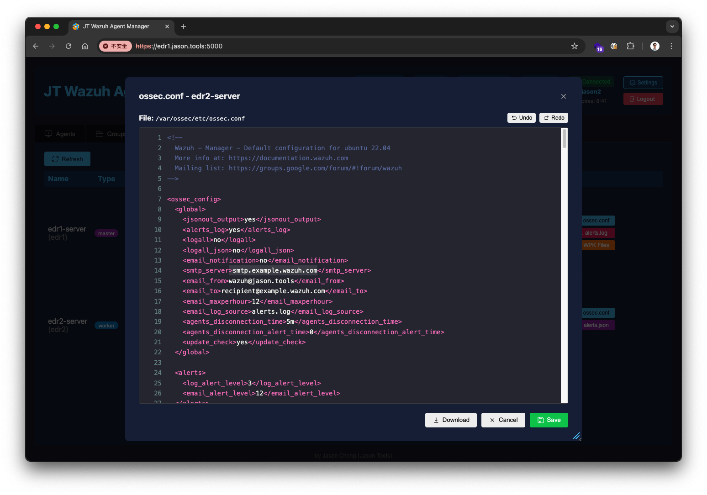

### Agent Upgrade


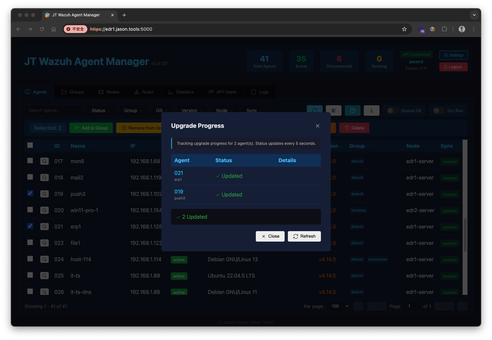

### Agent Detail
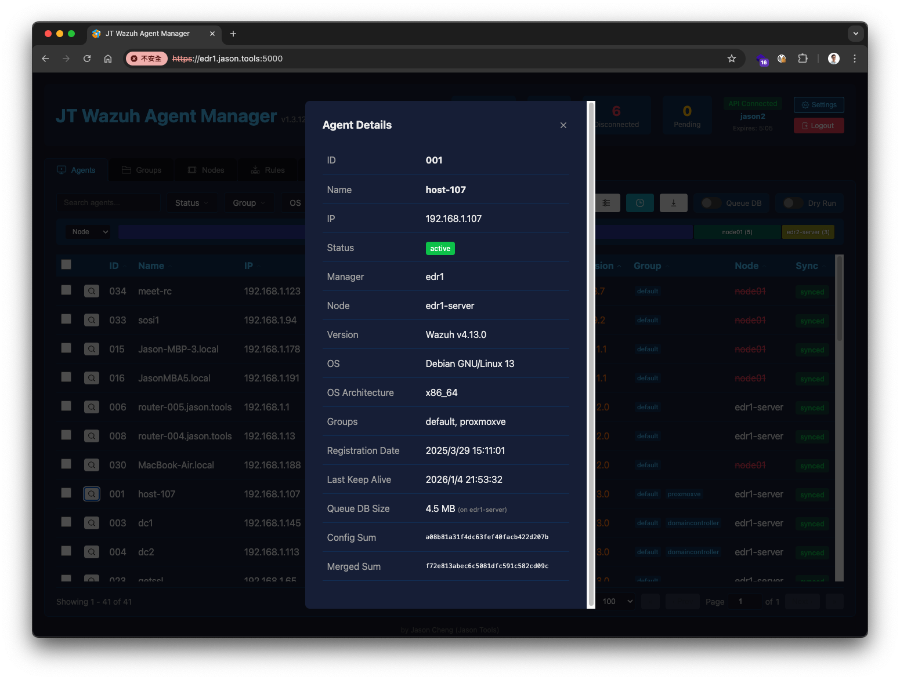

## Quick Start

### Requirements
- Python 3.8+
- Wazuh Manager 4.x
- **Must be installed on the Master node**

### Installation

```bash
# Clone to recommended directory
git clone https://github.com/jasoncheng7115/it-scripts.git /tmp/it-scripts
cp -r /tmp/it-scripts/jt_wazuh_agent_mgr /opt/
rm -rf /tmp/it-scripts
cd /opt/jt_wazuh_agent_mgr

# Install dependencies
pip install -r requirements.txt
```

### Quick Run (Recommended)

```bash
./wazuh_agent_mgr.py --web --ssl-auto
```

That's it! Open **https://YOUR_WAZUH_MANAGER_IP:5000** in your browser and login with your Wazuh API credentials.

> **Note**: Use `wazuh` or `wazuh-wui` account. Password can be found in `/var/ossec/etc/wazuh-passwords.txt`

### Other Options

```bash
# Custom port
./wazuh_agent_mgr.py --web --port 8443 --ssl-auto

# Custom SSL certificate
./wazuh_agent_mgr.py --web --ssl-cert /path/to/cert.pem --ssl-key /path/to/key.pem
```

## CLI Usage

```bash
# List all agents
./wazuh_agent_mgr.py agent list

# Filter agents
./wazuh_agent_mgr.py agent list --status=Active --group=production

# Quick status queries
./wazuh_agent_mgr.py agent disconnected
./wazuh_agent_mgr.py agent pending

# Group management
./wazuh_agent_mgr.py group list
./wazuh_agent_mgr.py group add-agent webservers 001 002 003

# Node management
./wazuh_agent_mgr.py node list
./wazuh_agent_mgr.py node reconnect 001 002

# Statistics
./wazuh_agent_mgr.py stats report
```

### Output Formats

Supports three output formats: `table` (default), `json`, `csv`

```bash
# Table format (default)
./wazuh_agent_mgr.py agent list --format=table

# JSON format (for programmatic processing)
./wazuh_agent_mgr.py agent list --format=json

# CSV format (for spreadsheet import)
./wazuh_agent_mgr.py agent list --format=csv

# Export to file
./wazuh_agent_mgr.py agent list --format=csv > agents.csv
./wazuh_agent_mgr.py stats report --format=json > report.json
```

## Configuration

Create `config.yaml`:

```yaml
wazuh_path: /var/ossec

# API settings
# Web UI mode: username/password NOT required (users login via browser)
# CLI mode: username/password REQUIRED for commands like ./wazuh_agent_mgr.py agent list
api:
  enabled: false           # set to true for CLI mode
  host: localhost
  port: 55000
  username: wazuh          # only for CLI mode
  password: "your-password"  # only for CLI mode, see /var/ossec/etc/wazuh-passwords.txt
  verify_ssl: false

# Optional: SSH for remote worker node management
ssh:
  enabled: true
  key_file: /root/.ssh/wazuh_cluster_key
  nodes:
    worker01:
      host: 192.168.1.100
      port: 22
      user: root
```

### Web UI vs CLI Configuration

| Setting | Web UI | CLI |
|---------|--------|-----|
| `api.enabled` | Not required | `true` |
| `api.username` | Not required (login via browser) | Required |
| `api.password` | Not required (login via browser) | Required |
| `ssh.*` | Optional (for remote node management) | Optional |

## Key Features Explained

### Dry-Run Mode
All write operations support `--dry-run` to preview actions without executing:
```bash
./wazuh_agent_mgr.py agent delete 001 --dry-run
# Output: [DRY-RUN] Would execute: /var/ossec/bin/manage_agents -r 001
```

### Agent Upgrade
- Upload WPK files for agent upgrades
- Track upgrade progress in real-time
- Support batch upgrades

### Cluster Sync Monitoring
- Monitor file synchronization between master and workers
- View sync details: Rules, Decoders, Groups, Keys, Lists, SCA
- Identify files that differ between nodes

## Tech Stack

- **Backend**: Python, Flask
- **Frontend**: Vanilla JavaScript, CSS
- **Wazuh Integration**: CLI commands + REST API

## Changelog

See [README_zh-TW.md](README_zh-TW.md) for full changelog (Chinese).

### Recent Updates (v1.3.x)
- Statistics page with sortable columns
- Security hardening (input validation, injection prevention)
- Upgrade history management
- Sync status loading indicators
- Favicon support
- HAProxy LB integration preparation

## Disclaimer

This software is provided "as is" without warranty of any kind, express or implied. The author is not responsible for any damages or losses arising from the use of this software. Use at your own risk.

Before performing any operations (especially delete, restart, or upgrade), it is strongly recommended to:
- Use `--dry-run` mode to preview actions
- Back up important configurations
- Test in a non-production environment first

## License

MIT License

## Author

Jason Cheng

---

**Note**: This tool must be installed on the Wazuh **Master node** and requires appropriate permissions to execute Wazuh CLI commands.
